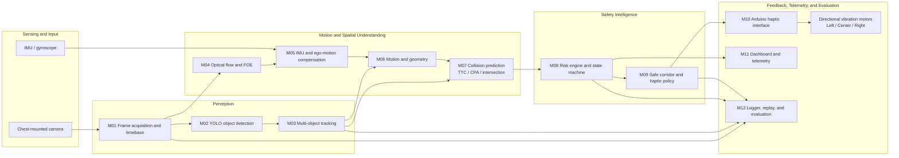

# SpatialVector-HMI System Architecture

SpatialVector-HMI is a local, camera-based assistive prototype that estimates whether observed motion may intersect the user's path, evaluates risk, selects a safer corridor, and communicates guidance through directional haptics.

The runtime flow is **Sense → Perceive → Understand → Predict → Decide → Assist**. The implementation is divided into modules M01–M12; this guide follows those module boundaries rather than presenting detection as a direct user command.

## Architecture Diagram

The standalone, editable Mermaid source is [`spatialvector_architecture.mmd`](spatialvector_architecture.mmd).



## Layer Responsibilities

### 1. Sensing and Input

The chest-mounted camera supplies timestamped frames to M01. An optional IMU/gyroscope supplies body-rotation measurements to M05. Camera and IMU data are time-sensitive: their timestamps allow the pipeline to reason about motion and expose stale or unavailable input.

### 2. Perception

- **M01 — Frame acquisition and timebase:** Captures and validates frames, assigns timestamps, and handles camera reconnect behavior.
- **M02 — Object detection:** Runs YOLOv8 nano and produces class-labelled bounding boxes and confidence values.
- **M03 — Multi-object tracking:** Associates detections across frames, maintains track identity/history, and estimates image-space movement.

Detection answers what appears in a frame. Tracking adds temporal identity; neither alone determines whether an object is on a collision course.

### 3. Motion and Spatial Understanding

- **M04 — Optical flow and FOE:** Estimates image motion and a focus-of-expansion cue from successive frames.
- **M05 — IMU and ego-motion compensation:** Reads gyroscope information and compensates for camera rotation where inputs are available. It exposes fallback/degraded conditions when compensation is unavailable or unreliable.
- **M06 — Motion and geometry:** Combines tracked-object state and motion cues to estimate bearing, normalized movement, and geometric relationships.
- **M07 — Collision prediction:** Evaluates time-to-collision (TTC), closest point of approach (CPA), trajectory intersection, and proximity evidence. TTC is a motion estimate, not a guarantee that a collision will occur.

### 4. Safety Intelligence

- **M08 — Risk engine and state machine:** Combines prediction and geometry evidence into a risk score/state, with temporal handling and explicit degraded behavior.
- **M09 — Safe corridor and haptic policy:** Evaluates left, center, and right corridor risk and stabilizes the selected guidance/pattern according to policy.

The system should preserve the distinction between a low-risk observation and missing or unreliable data. A degraded state is not equivalent to safe.

### 5. Feedback, Telemetry, and Evaluation

- **M10 — Arduino haptic interface:** Sends the selected haptic command to the serial/Arduino output path. The firmware drives the directional vibration motors and includes a hardware watchdog.
- **M11 — Dashboard and telemetry:** Exposes pipeline state and telemetry for observation. The dashboard is not the safety decision-maker; safety decisions are computed on the local processing machine.
- **M12 — Logger, replay, and evaluation:** Records timestamped pipeline information for debugging, deterministic replay, and scenario evaluation.

Audio feedback is not represented as a live output in this architecture: the current project documentation describes audio controls as coming soon, with no audio backend implemented.

## End-to-End Data Flow

1. M01 acquires camera frames and maintains the frame timebase.
2. M02 detects objects; M03 tracks them across frames.
3. M04 estimates optical flow/FOE, while M05 incorporates available IMU data and ego-motion compensation.
4. M06 derives motion and geometric cues; M07 evaluates potential path interaction using TTC, CPA, and intersection evidence.
5. M08 estimates risk and state; M09 selects and stabilizes corridor guidance.
6. M10 delivers haptic commands to the Arduino and motors. M11 provides telemetry for monitoring, and M12 records information for replay and evaluation.

## Important Signals

- **Bearing:** An object's horizontal position relative to the camera/user direction.
- **Relative motion:** Image/object movement over time, interpreted with camera motion where possible.
- **Time-to-collision (TTC):** An estimate based on relative motion and a collision condition; it becomes less reliable when motion estimates are weak.
- **Closest point of approach (CPA):** An estimate of the minimum separation of projected relative trajectories.
- **Risk state:** A policy-facing summary of multiple cues, not a direct restatement of object confidence.
- **Corridor:** A left/center/right region assessed for guidance; the selected direction is stabilized by the policy layer.

## Failure Handling and Safety Boundaries

Relevant degraded conditions include camera unavailability or stale frames, detector errors, lost tracks, insufficient motion history, unavailable or unreliable IMU data, low-confidence geometry, telemetry disconnection, and unavailable haptic hardware. These conditions should remain visible as degraded/unknown state instead of being silently interpreted as a clear path.

The dashboard is observational and can disconnect without becoming the safety decision-maker. The Arduino watchdog can stop motor output if commands stall. Neither mechanism makes this prototype a certified mobility aid; it is not a substitute for a cane, guide dog, or validated mobility support.

## Debugging Path

When a final direction or vibration seems wrong, trace the data upstream in order:

```text
Haptic command (M10)
  ← corridor and policy (M09)
  ← risk state (M08)
  ← collision prediction (M07)
  ← motion and geometry (M06)
  ← ego-motion / optical flow (M05 / M04)
  ← tracked objects (M03)
  ← detections (M02)
  ← captured frame and timestamp (M01)
```

Use M12 logs and replay where available to reproduce the same inputs before changing thresholds or policy.

## Repository Mapping

| Responsibility | Implementation area |
|---|---|
| Camera source and detection/tracking | [`spatialvector/perception/`](../spatialvector/perception/) |
| Optical flow, IMU, ego-motion, and geometry | [`spatialvector/motion/`](../spatialvector/motion/) |
| Prediction, risk, and corridor policy | [`spatialvector/decision/`](../spatialvector/decision/) |
| HMI, telemetry, and replay | [`spatialvector/hmi/`](../spatialvector/hmi/) |
| Arduino firmware | [`firmware/haptic_controller/`](../firmware/haptic_controller/) |
| Web dashboards | [`web/`](../web/) |
| Automated checks | [`tests/`](../tests/) |

For startup commands, module test commands, and live integration details, see the [root README](../README.md) and [Engineering Blueprint](../ENGINEERING_BLUEPRINT.md).
